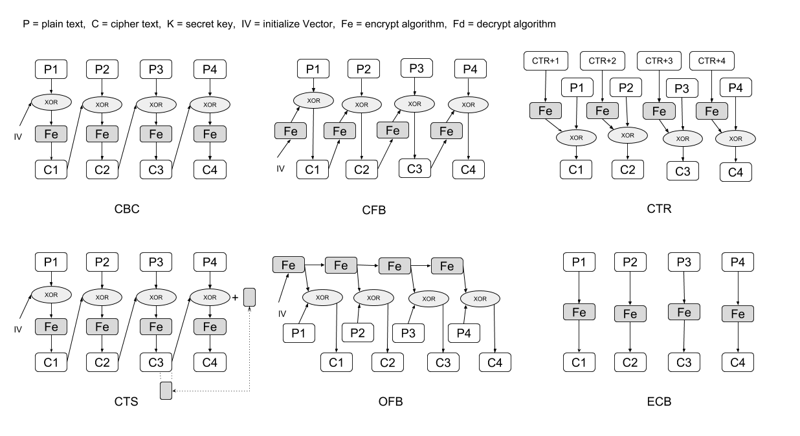

# Cipher Mode

**cipher mode six mode**



### CBC - Cipher Block Chaining

### CTS - Cipher Text Stealing

### CFB - Cipher FeedBack

### OFB - Output FeedBack

### CTR - CounTeR

### ECB - Electronic CodeBook *(not recommend use)*

## Installation

If [available in Hex](https://hex.pm/docs/publish), the package can be installed
by adding `cipher_mode` to your list of dependencies in `mix.exs`:

```elixir
def deps do
  [
    {:cipher_mode, "~> 0.1.0"}
  ]
end
```

Documentation can be generated with [ExDoc](https://github.com/elixir-lang/ex_doc)
and published on [HexDocs](https://hexdocs.pm). Once published, the docs can
be found at [https://hexdocs.pm/cipher_mode](https://hexdocs.pm/cipher_mode).

